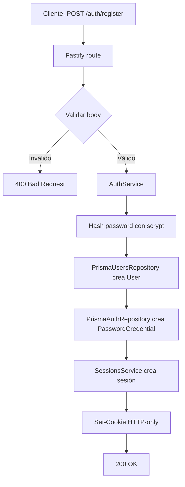
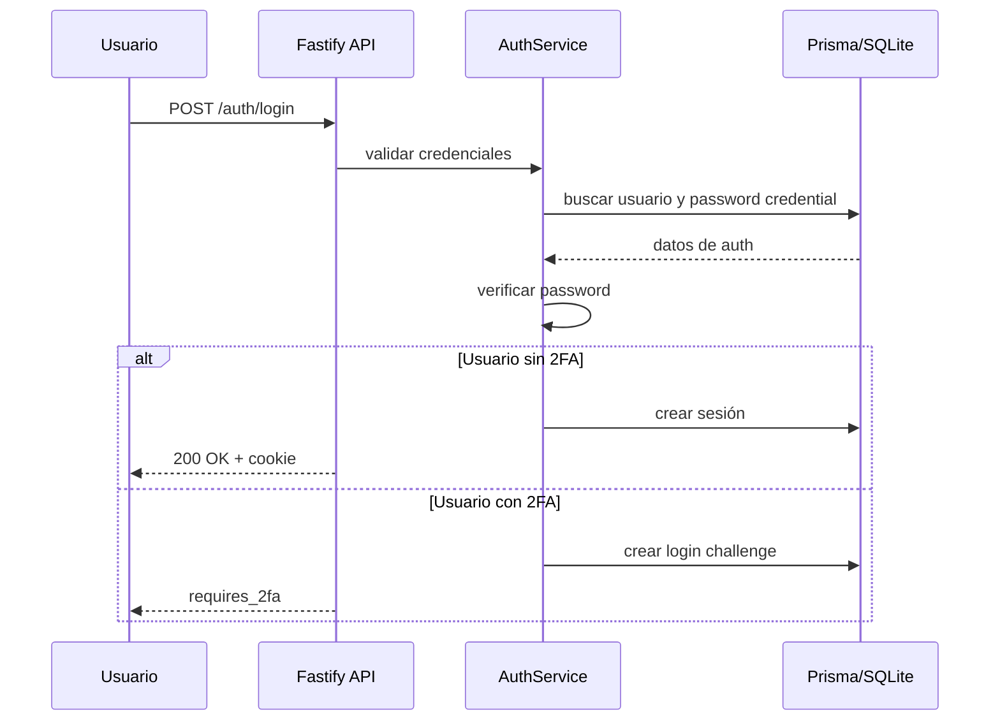
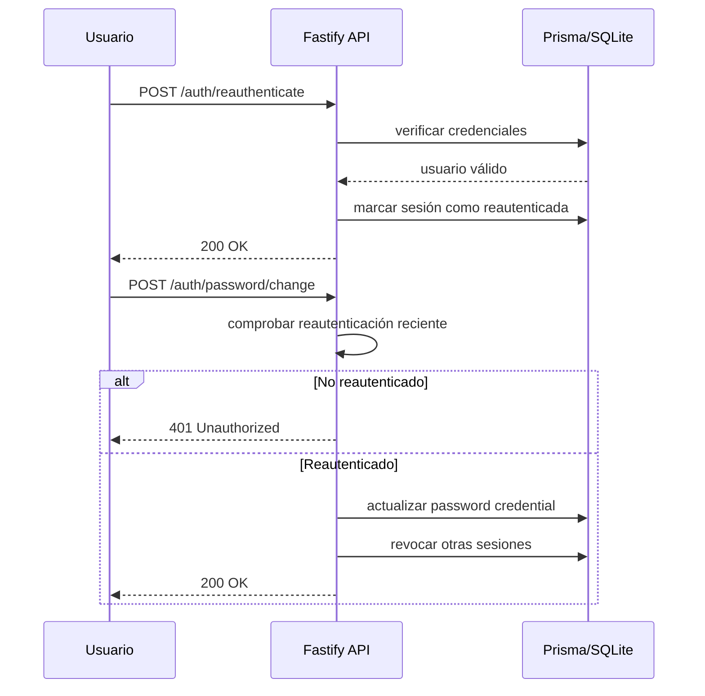

# Documentación del Proyecto Transcendence Backend

## 1. Introducción

Este backend es una base modular para el proyecto **Transcendence**. Actualmente cubre autenticación local, sesiones seguras, OAuth 42, 2FA TOTP, recovery codes y autorización básica por rol.

La prioridad de esta versión es mantener una arquitectura sencilla y rápida de extender para el resto del proyecto: juego, partidas, estadísticas, torneos, amistades/bloqueos y chat.

## 2. Tecnologías principales

- **Runtime:** Node.js.
- **Lenguaje:** TypeScript.
- **Framework HTTP:** Fastify.
- **Base de datos:** SQLite.
- **ORM:** Prisma.
- **Validación:** Zod.
- **Autenticación:** sesiones opacas de servidor mediante cookies HTTP-only.
- **Hash de contraseñas:** `scrypt` de Node.js.
- **2FA:** TOTP con `otplib`.

La decisión importante es esta: **la persistencia real usa Prisma + SQLite**. Ya no se usa PostgreSQL manual ni `pg`.

---

## 3. Conceptos básicos de TypeScript

TypeScript es JavaScript con tipos estáticos. Permite detectar errores antes de ejecutar el programa.

Ejemplo simple:

```ts
let edad: number = 25;
edad = "veinticinco"; // Error: string no es number
```

### Interfaces

Una interfaz define la forma esperada de un objeto:

```ts
interface Usuario {
  id: string;
  username: string;
  email: string | null;
  role: 'user' | 'admin';
}
```

Si falta un campo obligatorio o se usa un tipo incorrecto, TypeScript avisa al compilar.

### Tipos literales

El proyecto usa tipos estrictos para limitar valores posibles:

```ts
type UserRole = 'user' | 'admin';
type UserStatus = 'active' | 'disabled';
```

Esto evita estados ambiguos dentro del backend.

---

## 4. Arquitectura actual

El proyecto es un **monolito modular**: una sola aplicación Fastify dividida por dominios.

```text
src/
├── app.ts
├── server.ts
├── config/
├── db/
│   ├── prisma.ts
│   └── prismaMappers.ts
├── modules/
│   ├── users/
│   ├── auth/
│   ├── sessions/
│   ├── two_factor/
│   ├── oauth/
│   └── authorization/
├── shared/
└── ui/

prisma/
├── schema.prisma
└── migrations/
```

### Flujo general de una petición

1. El cliente envía una petición HTTP a Fastify.
2. La ruta valida los datos con Zod cuando corresponde.
3. El servicio de dominio ejecuta la lógica de negocio.
4. El repositorio lee o escribe datos usando Prisma.
5. Fastify responde con JSON y código HTTP adecuado.

---

## 5. Módulos principales

### `users`

Gestiona identidad y perfil mínimo:

- `id`
- `username`
- `email`
- `displayName`
- `role`
- `status`

No guarda contraseñas ni sesiones.

### `auth`

Gestiona:

- registro,
- login,
- challenges de login con 2FA,
- reautenticación,
- cambio de contraseña.

Las contraseñas se guardan hasheadas con `scrypt`, nunca en texto plano.

### `sessions`

Gestiona sesiones opacas de servidor:

- crea sesiones,
- busca sesiones por hash de token,
- revoca sesiones,
- marca sesiones como reautenticadas.

El navegador solo recibe una cookie. La base de datos guarda un hash del token, no el token en claro.

### `two_factor`

Gestiona:

- setup TOTP,
- confirmación TOTP,
- recovery codes,
- uso único de recovery codes,
- desactivación de 2FA.

Los secretos TOTP se cifran antes de guardarse.

### `oauth`

Gestiona OAuth 42:

- inicio de login OAuth,
- validación de `state`,
- callback,
- creación o resolución de usuario local,
- linking explícito de cuenta 42,
- unlink seguro.

El login y el linking usan estados separados para evitar mezclar flujos.

### `authorization`

Contiene helpers como:

- `requireAuth`,
- `requireRole`,
- obtención del usuario actual.

---

## 6. Base de datos con Prisma + SQLite

La base de datos está definida en:

```text
prisma/schema.prisma
```

Modelos actuales:

- `User`
- `PasswordCredential`
- `Session`
- `LoginChallenge`
- `TwoFactorTotp`
- `RecoveryCode`
- `OAuthAccount`
- `OAuthState`

SQLite se configura con:

```env
DATABASE_URL="file:./dev.db"
```

Los cambios de esquema se hacen modificando `prisma/schema.prisma` y creando migraciones Prisma.

Comandos útiles:

```bash
npx prisma generate
npx prisma migrate dev
npx prisma studio
```

Los archivos `.db` generados localmente no deben subirse al repositorio.

---

## 7. Diagramas de flujo

### Registro de usuario



### Login con 2FA opcional



### Cambio de contraseña con reautenticación



---

## 8. Endpoints principales

- `GET /`
- `GET /health`
- `POST /auth/register`
- `POST /auth/login`
- `POST /auth/login/2fa`
- `POST /auth/logout`
- `POST /auth/reauthenticate`
- `POST /auth/password/change`
- `GET /auth/oauth/42`
- `GET /auth/oauth/42/callback`
- `POST /auth/oauth/42/link/start`
- `GET /auth/oauth/42/link/callback`
- `DELETE /auth/oauth/42/link`
- `POST /2fa/setup`
- `POST /2fa/confirm`
- `POST /2fa/recovery-codes/regenerate`
- `DELETE /2fa`
- `GET /me`
- `GET /admin/users`

---

## 9. Instalación y ejecución

Instalar dependencias:

```bash
npm install
```

Crear `.env` desde `.env.example`.

Generar clave TOTP:

```bash
node -e "console.log(require('crypto').randomBytes(32).toString('base64'))"
```

Preparar Prisma:

```bash
npx prisma generate
npx prisma migrate dev
```

Compilar:

```bash
npm run build
```

Arrancar:

```bash
npm start
```

Ejecutar tests:

```bash
npm test
```

Los tests usan repositorios en memoria con `NODE_ENV=test`, así que no necesitan SQLite real.

---

## 10. Seguridad implementada

- Cookies HTTP-only para sesiones.
- Tokens de sesión opacos.
- Hash del token en base de datos, no token en claro.
- Hash de contraseñas con `scrypt`.
- Secretos TOTP cifrados.
- Recovery codes hasheados y de un solo uso.
- Separación explícita entre login OAuth y linking OAuth.
- Reautenticación para acciones sensibles.
- Revocación de otras sesiones tras cambios sensibles.

---

## 11. Próximos pasos naturales

Después de esta base, lo más útil es añadir sobre Prisma:

1. modelos de partidas,
2. estadísticas de usuario,
3. torneos,
4. amistades/bloqueos,
5. chat,
6. autenticación de WebSocket leyendo la sesión/cookie existente.

No conviene rehacer auth con JWT salvo que aparezca una razón concreta. Para este proyecto, las sesiones actuales ya encajan bien.

---

Última actualización: 2026-06-15.
